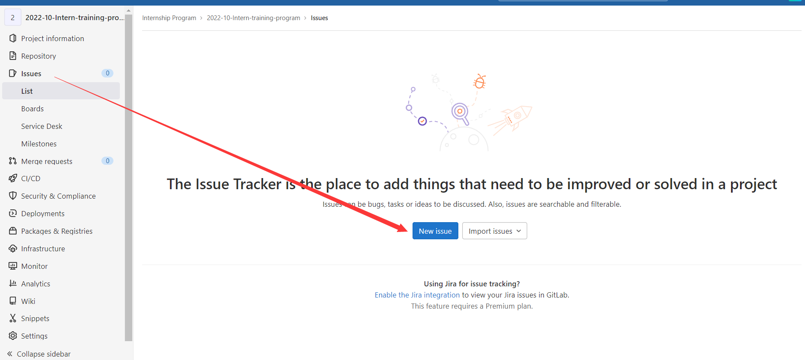
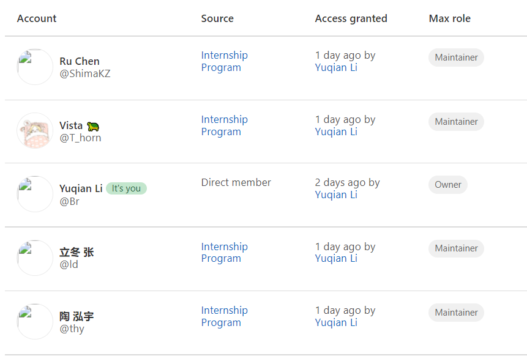

# 2022-10-Intern-training-program

xlab 2022年国庆期间纳新，实习成员练手仓库

## 我需要做什么

本次练手分为前端练手项目与后端练手项目。你需要选择其中一个项目进行学习。

**警告：请不要抄袭其他实习成员的成果**

## 我该如何使用本仓库进行学习

该内容属于基础的git使用。在操作之前请详细阅读我们分发的[git教程](https://xn4zlkzg4p.feishu.cn/wiki/wikcng1yvT4M86NXbVb0llp9xZd)。

1. Fork整个仓库

2. Clone你Fork下来的仓库至你的本地

3. 在本地仓库中写代码

4. 将本地的代码修改commit且push到你Fork下来的仓库中

## 我该如何提交我的成果

当你完成了所有的成果之后，请给**本仓库**提出issue，issue需遵循以下格式：

- Title: ${你的名字}-repo
- Description: ${你的仓库地址} + 其他想说的（可选）

**注意：请确保以下人员拥有对你的仓库的访问权限，否则我们将无法验收你的成果！**

> 你可以单独为以下成员添加访问权限，或将你的仓库的可见性调成 public

 

-----

源项目仓库分支已被protect，请不要试图修改（push）源仓库代码和文档。

若以上操作没有成功，或者有任何问题，请及时在 **2022-10 实习答疑群** 群内提问，并附上 **#入门答疑 #Git**  或其他合适的Tag。具体格式请参照答疑群内已有示例格式。
